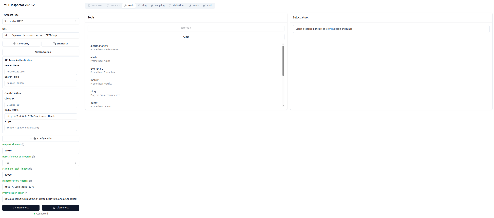
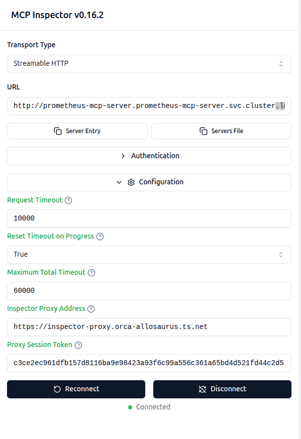
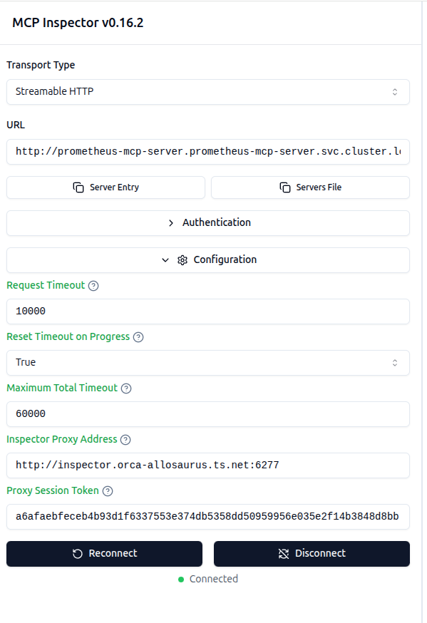
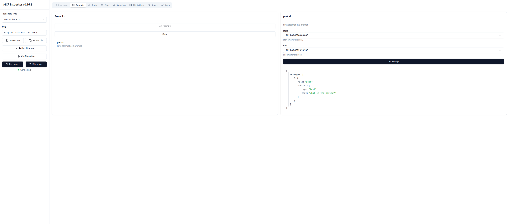

# MCP Inspector



|Entry|URL|
|-----|---|
|Streamable HTTP|`http://prometheus-mcp-server:7777/mcp`|
|Inspector Proxy|`http://localhost:6277`|

Confusingly, the Inspector Proxy URL must be `localhost` (`inspector` doesn't work)

> **NOTE** Don't need to set the "Inspector Proxy Address" (in Configuration) because the default value works.

```bash
podman network inspect mcp
```
```JSON
[
     {
          "name": "mcp",
          "id": "a71a6a2229372908ac9cbc4d1504a8274600a1a0855bf515fe1de7c7cc305f35",
          "driver": "bridge",
          "network_interface": "podman1",
          "created": "2025-08-05T08:50:27.82757109-07:00",
          "subnets": [
               {
                    "subnet": "10.89.0.0/24",
                    "gateway": "10.89.0.1"
               }
          ],
          "ipv6_enabled": false,
          "internal": false,
          "dns_enabled": true,
          "ipam_options": {
               "driver": "host-local"
          },
          "containers": {
               "c4ecb329cc2a672e21a3c7c9a8afda4590625224e0ce33327410df7e8148dd18": {
                    "name": "prometheus-mcp-server",
                    "interfaces": {
                         "eth0": {
                              "subnets": [
                                   {
                                        "ipnet": "10.89.0.12/24",
                                        "gateway": "10.89.0.1"
                                   }
                              ],
                              "mac_address": "2a:20:85:4e:af:ae"
                         }
                    }
               },
               "dc3e961f3663a32818b145169e3678ea2756ef21113f48b2068794d7f17d5019": {
                    "name": "busyboxplus",
                    "interfaces": {
                         "eth0": {
                              "subnets": [
                                   {
                                        "ipnet": "10.89.0.9/24",
                                        "gateway": "10.89.0.1"
                                   }
                              ],
                              "mac_address": "3a:55:b7:d5:57:19"
                         }
                    }
               },
               "f79d111cc6507eff551e43776027919cbb0dc750f28bb0612ca12087e9ddb21d": {
                    "name": "inspector",
                    "interfaces": {
                         "eth0": {
                              "subnets": [
                                   {
                                        "ipnet": "10.89.0.19/24",
                                        "gateway": "10.89.0.1"
                                   }
                              ],
                              "mac_address": "b2:ab:96:1a:b9:0f"
                         }
                    }
               }
          }
     }
]
```

## Local

### Prometheus MCP Server

Uses network `mcp` and publishes DNS `prometheus-mcp-server`:

```bash
IMAGE="ghcr.io/dazwilkin/prometheus-mcp-server:8a9a6010dacb0224ca49ec34df8b17a835558280"

# Prometheus MCP server
SERVER_HOST="0.0.0.0"
SERVER_PORT="7777"
SERVER_ADDR="${SERVER_HOST}:${SERVER_PORT}"
SERVER_PATH="/mcp"

# Prometheus MCP metrics exporter
METRIC_HOST="0.0.0.0"
METRIC_PORT="8080"
METRIC_ADDR="${METRIC_HOST}:${METRIC_PORT}"
METRIC_PATH="/metrics"

PROMETHEUS_URL="https://prometheus.orca-allosaurus.ts.net"

# DNS prometheus-mcp-server
# Accessible from host using 7777 and 8080
podman run \
--interactive --tty --rm \
--name=prometheus-mcp-server \
--network=mcp \
--publish="${SERVER_PORT}:${SERVER_PORT}/tcp" \
--publish="${METRIC_PORT}:${METRIC_PORT}/tcp" \
${IMAGE} \
--server.addr="${SERVER_ADDR}" \
--server.path="${SERVER_PATH}" \
--metric.addr="${METRIC_ADDR}" \
--metric.path="${METRIC_PATH}" \
--prometheus="${PROMETHEUS_URL}"
```
```JSON
{"time":"2025-08-05T15:52:45.844794617Z","level":"INFO","msg":"Build config","build_time":"","git_commit":"8a9a6010dacb0224ca49ec34df8b17a835558280","os_version":"6.11.0-1015-azure","go_version":"go1.24.4","start_time":"1754409165"}
{"time":"2025-08-05T15:52:45.8455345Z","level":"INFO","msg":"Starting Prometheus metrics exporter","metric.addr":"0.0.0.0:8080","metric.path":"/metrics"}
{"time":"2025-08-05T15:52:45.845645576Z","level":"INFO","msg":"Starting Prometheus MCP server"}
{"time":"2025-08-05T15:52:45.845691785Z","level":"INFO","msg":"ServerOptions","function":"run","opts":[]}
{"time":"2025-08-05T15:52:45.845748835Z","level":"INFO","msg":"Creating new Prometheus client","function":"run"}
{"time":"2025-08-05T15:52:45.84578728Z","level":"INFO","msg":"StdioOptions","function":"run","opts":[]}
{"time":"2025-08-05T15:52:45.845802447Z","level":"INFO","msg":"Configuring Server to use HTTP streaming","function":"run","server.addr":"0.0.0.0:7777","server.path":"/mcp"}
{"time":"2025-08-05T15:52:45.846436627Z","level":"INFO","msg":"Starting Prometheus metrics exporter","function":"metrics","url":"0.0.0.0:8080//metrics"}
{"time":"2025-08-05T15:55:27.381832139Z","level":"INFO","msg":"Alerts retrieved","function":"run","method":"Alerts","alerts":4}
```

### Inspector

Uses network `mcp`, publishes DNS `inspector` and requires `ALLOWED_ORIGINS=http://0.0.0.0:6274`:

```bash
source .env.test

VERS="0.16.2"

# Local
ALLOWED_ORIGINS="http://localhost:6274"

# Kubernetes
# Ingress
# ALLOWED_ORIGINS="https://inspector-webui.${TAILNET}"

# Service
# ALLOWED_ORIGINS="http://inspector.${TAILNET}:6274"

podman run \
--interactive --tty --rm \
--name=${INSPECTOR_NAME} \
--network=mcp \
--env=HOST=0.0.0.0 \
--env=ALLOWED_ORIGINS=${ALLOWED_ORIGINS} \
--env=MCP_AUTO_OPEN_ENABLED=false \
--env=MCP_PROXY_AUTH_TOKEN=${PROXY_TOKEN} \
--publish=6274:6274/tcp \
--publish=6277:6277/tcp \
ghcr.io/modelcontextprotocol/inspector:${VERS}
```
This doesn't appear to work; it's not possible to set `http-streamable` in config (see [#622](https://github.com/DazWilkin/prometheus-mcp-server/issues/622))
```bash
--volume=${PWD}/inspector.config.json:/config.json:ro \
--config=/config.json
```
```
> @modelcontextprotocol/inspector@0.16.2 start
> node client/bin/start.js

Starting MCP inspector...
⚙️ Proxy server listening on inspector:6277
🔑 Session token: 8c63a564c80f29b7d5d97144c19bc4281f2692af9a36e6eb8f859cd2df80d8b9
   Use this token to authenticate requests or set DANGEROUSLY_OMIT_AUTH=true to disable auth

🚀 MCP Inspector is up and running at:
   http://inspector:6274/?MCP_PROXY_AUTH_TOKEN=8c63a564c80f29b7d5d97144c19bc4281f2692af9a36e6eb8f859cd2df80d8b9

🌐 Opening browser...
New StreamableHttp connection request
Query parameters: {"url":"http://localhost:7777/mcp","transportType":"streamable-http"}
Created StreamableHttp server transport
Created StreamableHttp client transport
Client <-> Proxy  sessionId: bdc268c0-5504-4e15-b5e9-f0572d685e60
Connection refused. Is the MCP server running?
New StreamableHttp connection request
Query parameters: {"url":"http://localhost:7777/mcp","transportType":"streamable-http"}
Created StreamableHttp server transport
Created StreamableHttp client transport
Client <-> Proxy  sessionId: 35d10e87-2b2e-4f27-ac7f-87c59b4a6579
Connection refused. Is the MCP server running?
New StreamableHttp connection request
Query parameters: {"url":"http://prometheus-mcp-server:7777/mcp","transportType":"streamable-http"}
Created StreamableHttp server transport
Created StreamableHttp client transport
Client <-> Proxy  sessionId: deead8e7-452c-4499-96b9-b3ad30e0bec5
Received POST message for sessionId deead8e7-452c-4499-96b9-b3ad30e0bec5
Received GET message for sessionId deead8e7-452c-4499-96b9-b3ad30e0bec5
Received POST message for sessionId deead8e7-452c-4499-96b9-b3ad30e0bec5
```

### `busyboxplus`

Uses network `mcp` and publishes DNS `busyboxplus`:

```bash
podman run \
--interactive --tty --rm \
--name=busyboxplus \
--network=mcp \
docker.io/radial/busyboxplus:curl
```
```bash
curl http://prometheus-mcp-server:8080/metrics
```
```console
# HELP go_gc_duration_seconds A summary of the wall-time pause (stop-the-world) duration in garbage collection cycles.
# TYPE go_gc_duration_seconds summary
go_gc_duration_seconds{quantile="0"} 0
go_gc_duration_seconds{quantile="0.25"} 0
go_gc_duration_seconds{quantile="0.5"} 0
go_gc_duration_seconds{quantile="0.75"} 0
go_gc_duration_seconds{quantile="1"} 0
go_gc_duration_seconds_sum 0
go_gc_duration_seconds_count 0
...
```
```bash
nslookup inspector
```
```console
Server:    10.89.0.1
Address 1: 10.89.0.1

Name:      inspector
Address 1: 10.89.0.8 inspector
```
```bash
 curl http://inspector:6277/health
```
```JSON
{"status":"ok"}
```

## Kubernetes

The [Proxy Session Token](#proxy-session-token) is required by the MCP Inspector UI. It is logged in the output the Inspector when it starts and is configured in the `Deployment`'s env vars `MCP_PROXY_AUTH_TOKEN`

Using Ingresses:



|Key|Value|
|---|-----|
|Transport Type|Streamable HTTP|
|URL|`http://${NAME}.${NAMESPACE}.svc.cluster.local:${SERVER_PORT}/mcp`|
|Inspector Proxy Address|`https://${NAME}-proxy.${TAILNET}`|

Using Service:



|Key|Value|
|---|-----|
|Transport Type|Streamable HTTP|
|URL|`http://${NAME}.${NAMESPACE}.svc.cluster.local:${SERVER_PORT}/mcp`|
|Inspector Proxy Address|`http://${NAME}.${TAILNET}`|

```bash
NAMESPACE="prometheus-mcp-server"

# Validator
./inspector.validate.sh

# Deployer
./inspector.sh \
| jq -r . \
| kubectl apply \
  --filename=- \
  --namespace=${NAMESPACE}
```

|Name|Kind|Notes|
|----|----|-----|
|`{NAME}`|Deployment|Publishes `webui` (6274) and `proxy` (6277)|
|`{NAME}`|Service|Exposes `webui` and `proxy`|
|`{NAME}-webui`|Ingress|Optional: Publishes `webui`|
|`{NAME}-proxy`|Ingress|Optional: Publishes `proxy`|
|`{NAME}`|VPA||

> **NOTE** `Deployment` constructs reference to the WebUI FQDN (Tailnet) in order to be able tto permit CORS (Allowed Origins)

### `ALLOWED_ORIGINS`

```bash

Confirm the CORS (Allowed Origins) value(s):

```bash
(
  NAME="inspector"
  NAMESPACE="prometheus-mcp-server"

  ENVVAR="ALLOWED_ORIGINS"

  FILTER="{.spec.template.spec.containers[?(@.name==\"${NAME}\")].env[?(@.name==\"${ENVVAR}\")].value}"

  kubectl get deployment/${NAME} \
  --namespace=${NAMESPACE} \
  --output=jsonpath="${FILTER}{'\n'}"
)
```

### Proxy Session Token

Obtain the Proxy Session Token to be pasted into the Inspector Web UI:

```bash
(
  NAME="inspector"
  NAMESPACE="prometheus-mcp-server"

  ENVVAR="MCP_PROXY_AUTH_TOKEN"

  FILTER="{.spec.template.spec.containers[?(@.name==\"${NAME}\")].env[?(@.name==\"${ENVVAR}\")].value}"

  kubectl get deployments.apps/${NAME} \
  --namespace=${NAMESPACE} \
  --output=jsonpath="${FILTER}{'\n'}"
)
```

### Debugging

```bash
kubectl run \
--stdin --tty --rm \
debug \
--image=docker.io/radial/busyboxplus:curl \
--restart=Never \
-- sh
```
```bash
NAME="inspector"
NAMESPACE="prometheus-mcp-server"

TOKEN="..." # From above
```
```bash
curl \
--header "X-MCP-Proxy-Auth: Bearer ${TOKEN}" \
http://${NAME}.${NAMESPACE}.svc.cluster.local:6277/config 
```
```JSON
{
  "defaultEnvironment":{
     "HOME":"/root",
     "PATH":"/app/node_modules/.bin:/node_modules/.bin:/usr/local/lib/node_modules/npm/node_modules/@npmcli/run-script/lib/node-gyp-bin:/usr/local/sbin:/usr/local/bin:/usr/sbin:/usr/bin:/sbin:/bin"
  },
  "defaultCommand":"",
  "defaultArgs":""
}
```
```bash
curl http://${NAME}.${NAMESPACE}.svc.cluster.local:6277/health
```
```JSON
{"status":"ok"}
```

## Test

Use the Inspector's API to test.

### Proxy Health

```bash
curl \
--silent \
--get \
http://localhost:6277/health \
| jq -r .
```
```JSON
{
  "status": "ok"
}
```

### MCP server

#### `initialize`

```bash
TOKEN="..."

DATA='{
  "method": "initialize",
  "params": {
    "protocolVersion": "2025-06-18",
    "capabilities": {
      "sampling": {},
      "elicitation": {},
      "roots": {
        "listChanged": true
      }
    },
    "clientInfo": {
      "name": "mcp-inspector",
      "version": "0.16.2"
    }
  },
  "jsonrpc": "2.0",
  "id": 0
}'

# Not possible to data-urlencode and POST JSON body
# curl \
# --silent \
# --request POST \
# --header "Content-Type: application/json" \
# --header "x-mcp-proxy-auth: Bearer ${TOKEN}" \
# --data-urlencode "url=http://localhost:7777/mcp" \
# --data-urlencode "transportType=streamable-http" \
# --data "${DATA}" \
# http://localhost:6277/mcp \
# | jq -r .

QUERYSTRING="url=http%3A%2F%2Fprometheus-mcp-server%3A7777%2Fmcp&transportType=streamable-http"

curl \
--silent \
--request POST \
--header "Content-Type: application/json" \
--header "Accept: application/json;text/event-stream" \
--header "X-MCP-Proxy-Auth: Bearer ${TOKEN}" \
--data "${DATA}" \
"http://localhost:6277/mcp?${QUERYSTRING}" \
| jq -r .
```

#### `tools/list`

```bash
TOKEN="..."

DATA='{
  "method": "tools/list",
  "params": {
    "_meta": {
      "progressToken": 1
    }
  },
  "jsonrpc": "2.0",
  "id": 1
}'

# Not possible to data-urlencode and POST JSON body
# curl \
# --silent \
# --request POST \
# --header "Content-Type: application/json" \
# --header "X-MCP-Proxy-Auth: Bearer ${TOKEN}" \
# --data-urlencode "url=http://localhost:7777/mcp" \
# --data-urlencode "transportType=streamable-http" \
# --data "${DATA}" \
# http://localhost:6277/mcp \
# | jq -r .

# Statically define URL-encoded QueryString
QUERYSTRING="url=http%3A%2F%2Fprometheus-mcp-server%3A7777%2Fmcp&transportType=streamable-http"

curl \
--silent \
--request POST \
--header "Content-Type: application/json" \
--header "Accept: application/json;text/event-stream" \
--header "X-MCP-Proxy-Auth: Bearer ${TOKEN}" \
--data "${DATA}" \
"http://localhost:6277/mcp?${QUERYSTRING}" \
| jq -r .
```

## Prompts

Continue to be confused at the difference between Resources and Tools.

However, Prompts seem more obvious, but...

```golang
s.AddPrompts([]server.ServerPrompt{
	{
		Prompt: mcp.Prompt{
			Name:        "period",
			Description: "First attempt at a prompt",
			Arguments: []mcp.PromptArgument{
				{
					Name:        "start",
					Description: "Start time for the query",
				},
				{
					Name:        "end",
					Description: "End time for the query",
				},
			},
		},
		Handler: func(ctx context.Context, rqst mcp.GetPromptRequest) (*mcp.GetPromptResult, error) {
			logger.Info("Handling GetPromptRequest", "request", rqst)
			return &mcp.GetPromptResult{
				Messages: []mcp.PromptMessage{
					{
						Role:    mcp.RoleUser,
						Content: mcp.NewTextContent("What is the period?"),
					},
				},
			}, nil
		},
	},
}...)
```

And:

]